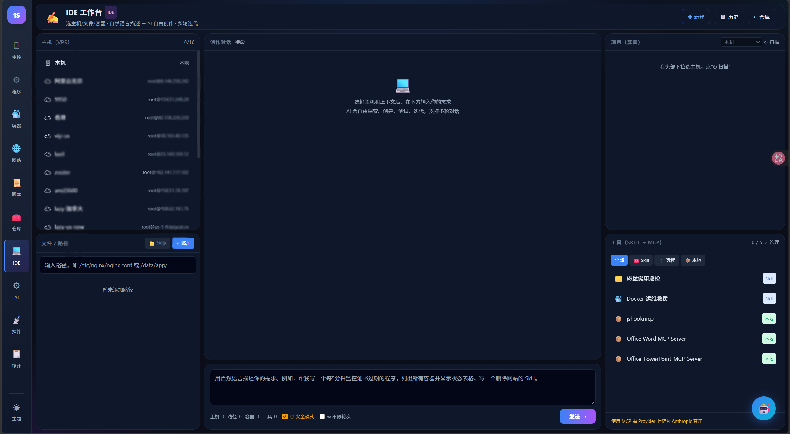
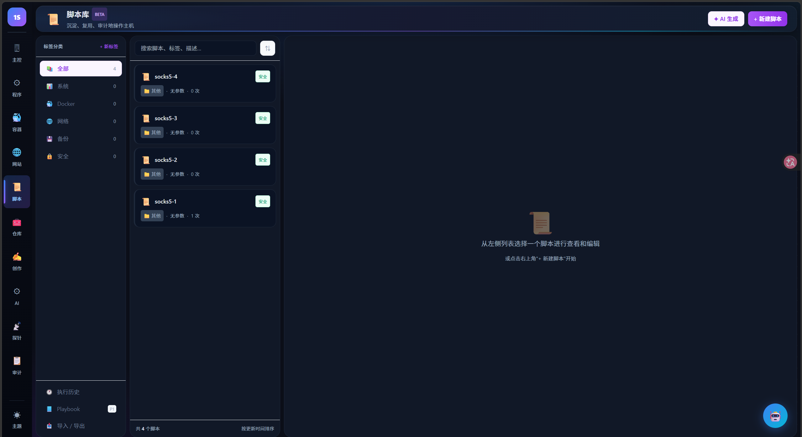

# 板块七：Skill、Playbook、脚本库与创作工作台

---

## 1. 创作工作台（IDE 工作台）

创作工作台是 1Shell 的 AI 创作中心，用于创建和管理 Program、Skill、Playbook。

进入方式：左侧导航栏 → **「创作」**



### 1.1 界面布局

- **左侧**：主机列表 + 文件树（可浏览主机上的文件）
- **中间**：AI 对话区域，用自然语言描述需求
- **右侧**：Skill 列表 + MCP 工具列表
- **底部**：工具开关（工具、学习能力、不联网）

### 1.2 使用方式

1. 在左侧选择目标主机（点亮主机名称）
2. 在中间输入框描述需求，例如：
   - 「帮我创建一个每 5 分钟检查 CPU 和内存的监控程序」
   - 「写一个磁盘清理的 Skill」
   - 「写一个批量部署 Docker 的 Playbook」
3. AI 自动创建对应的产物并写入文件

### 1.3 右侧面板

- **Skill 列表**：显示仓库中已有的 Skill（如磁盘健康巡检、Docker 运维救援）
- **MCP 工具列表**：显示已接入的 MCP 工具（如 phxdmcp、Office Word MCP Server）

---

## 2. Skill（AI 能力包）

Skill 是 AI 的能力模块，可被 Program 的 L2 层调用。

### 2.1 什么是 Skill

- 封装一个特定领域的 AI 能力（如磁盘清理、Docker 救援）
- 包含工作流（workflow）、约束规则（rules）、参考资料（references）
- 被 Program 调用时，AI 在 Skill 定义的范围内执行操作

### 2.2 查看已有 Skill

进入「仓库」页面（左侧导航 → 仓库），切换到 **Skill** 标签页。

每个 Skill 卡片显示名称、ID 和标签。

### 2.3 创建 Skill

在创作工作台中描述需求，AI 自动生成 Skill 文件结构：

```
data/skills/<skill-id>/
├── SKILL.md           # 路由与能力描述
├── rules/             # 约束规则
├── workflows/         # 工作流步骤
└── references/        # 参考资料
```

---

## 3. Playbook（一次性脚本）

Playbook 是一次性执行的 AI 脚本，适合临时操作。

### 3.1 与 Program 的区别

| | Program | Playbook |
|---|---------|----------|
| **执行方式** | 按 cron 定时执行，长期运行 | 一次性执行 |
| **适用场景** | 持续监控、定期巡检 | 批量部署、一次性清理、临时排障 |
| **AI 引擎** | 三层（L1/L2/L3） | 单次 AI 执行 |

### 3.2 使用方式

- 在终端工具栏点击 **「Playbook」** 按钮
- 或在创作工作台中创建

---

## 4. 脚本库

脚本库用于管理常用的 Shell 脚本。

进入方式：左侧导航栏 → **「脚本」**



### 4.1 界面布局

- **左侧**：脚本分类（全部、Docker、网络、常用、安全等）
- **中间**：当前分类下的脚本列表
- **右侧**：脚本内容预览和编辑

### 4.2 功能

| 操作 | 说明 |
|------|------|
| **新建脚本** | 右上角「新建脚本」按钮 |
| **分类管理** | 按类型组织脚本 |
| **搜索** | 按名称、标签、描述搜索 |
| **预览/编辑** | 选中脚本后在右侧查看和修改 |
| **注入终端** | 将脚本注入当前终端执行 |
| **导入/导出** | 批量导入导出脚本 |

### 4.3 与终端的配合

在终端工具栏点击 **「脚本」** 按钮，弹出脚本选择器，选择脚本后一键注入终端执行。
