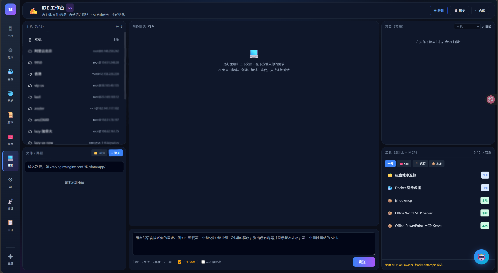
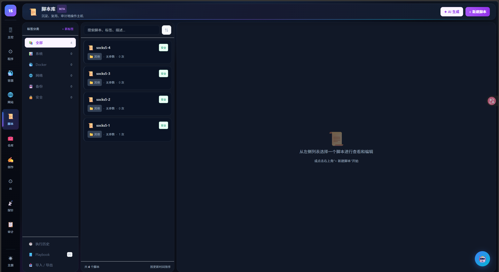

# 板块七：Skill、Playbook、脚本库与创作工作台

---

## 1. 创作工作台（IDE 工作台）

创作工作台是 1Shell 的 AI 创作中心，用于创建和管理 Program、Skill、Playbook。

进入方式：左侧导航栏 → **「创作」**



### 1.1 界面布局

- **左侧**：主机列表 + 文件树（可浏览主机上的文件）
- **中间**：AI 对话区域，用自然语言描述需求
- **右侧**：Skill 列表 + MCP 工具列表
- **底部**：工具开关（工具、学习能力、不联网）

### 1.2 使用方式

1. 在左侧选择目标主机（点亮主机名称）
2. 在中间输入框描述需求，例如：
   - 「帮我创建一个每 5 分钟检查 CPU 和内存的监控程序」
   - 「写一个磁盘清理的 Skill」
   - 「写一个批量部署 Docker 的 Playbook」
3. AI 自动创建对应的产物并写入文件

### 1.3 右侧面板

- **Skill 列表**：显示仓库中已有的 Skill（如磁盘健康巡检、Docker 运维救援）
- **MCP 工具列表**：显示已接入的 MCP 工具（如 phxdmcp、Office Word MCP Server）

---

## 2. 双轨 Skill 体系

1Shell 将 Skill 分为两类：**1Shell Skill Extension** 和 **Claude Code Skill**。两者都使用 `SKILL.md` 作为入口，但运行时、管理方式、作用范围和语义边界不同。

这次梳理后的结论是：**1Shell Skill Extension 是给 1Shell runner / Program L2 使用的 AI 约束包；Claude Code Skill 是标准 Claude Code 生态 Skill，1Shell 只负责托管、启用/禁用、查看和更新。**

### 2.1 1Shell Skill Extension

1Shell Skill Extension 是 1Shell 自己的运行时能力包，由 1Shell AI runner 执行，可被 Program 的 L2 层调用。

适用场景：

- 需要操作本机或远程主机，如 Docker、Nginx、文件、探针、MCP 管理
- 需要 1Shell 的 `execute_command`、`ask_user`、`render_result` 等结构化工具
- 需要目标主机、表单输入、危险操作确认、结构化结果展示
- 需要 AI 临场判断；如果步骤完全确定，应创建 Playbook

当前兼容路径仍为：

```
data/skills/<skill-id>/
├── SKILL.md           # 触发条件、输入表单、任务路由
├── rules/             # 硬约束，会注入 system prompt
├── workflows/         # 执行判断与流程指引
├── references/        # 参考资料
├── data/              # 可选：结构化知识库
├── scripts/           # 可选：辅助检索/生成脚本
└── templates/         # 可选：生成模板
```

后续 UI 可以展示为「1Shell 扩展」，但底层保留 `data/skills/` 以兼容现有创作台、Program、runner。

### 2.2 Claude Code Skill

Claude Code Skill 是标准 Claude Code 生态的 Skill 包，通常来自外部 GitHub 仓库或插件市场。

适用场景：

- 导入成熟领域知识包，如 UI/UX、代码审查、文档生成、测试策略
- 在 1Shell 仓库中集中托管、查看、更新、启用或禁用标准 Skill
- 保留标准 `SKILL.md`、`references/`、`examples/`、`scripts/`、`data/` 等原始资源

1Shell 内部托管路径：

```
data/claude-code-skills/<skill-id>/
├── manifest.json      # 1Shell 托管元数据：来源、版本、导入时间
└── source/            # 原始仓库内容
    └── ...
```

Claude Code Skill 默认**不直接进入 1Shell runner 执行链**，避免把外部工具假设误当成 1Shell 运维能力。标准 Skill 的制作和执行仍属于 Claude Code 生态，1Shell 不做自动转换。

### 2.3 作用范围

1Shell Skill Extension 不会默认作用于日常 1Shell AI 对话，也不是全局开启的规则包。它只在以下场景生效：

- 用户在仓库或终端里手动运行某个 1Shell Skill Extension
- 创作台 / IDE 工具显式调用 `run_skill`
- Program 的某个 step 声明 `type: skill` 并指定 `skill: <skill-id>`，也就是显式 Program L2 功能调用
- Program 配置 `l2.skill` 后，L1 exec 失败会先唤起该 Skill 约束下的 L2 维护层

普通 1Shell AI、全局悬浮 AI、主控右栏 AI 使用 core prompt，不会自动加载 `data/skills/` 中的具体 Skill。创作台使用 authoring prompt，只包含产物创作规则；真正的 Skill runtime 仍由 runner / Program L2 在指定 Skill 时加载。

### 2.4 查看与管理

进入「仓库」页面（左侧导航 → 仓库）：

- **1Shell 扩展**：显示 `data/skills/` 中的可运行能力包，可由创作台生成
- **Claude Code Skill**：显示 `data/claude-code-skills/` 中托管的标准 Skill，可从 GitHub 链接导入
- **MCP Server / 本地 MCP**：继续管理 1Shell AI 可用工具

### 2.5 创建、导入与启用状态

- 创建 1Shell Skill Extension：在创作工作台中描述需求，由 AI 生成 `SKILL.md + rules/workflows/references`
- 导入 Claude Code Skill：在仓库页面粘贴 GitHub 链接，1Shell 下载并登记到内部托管目录
- 禁用 Claude Code Skill：只改变 1Shell 仓库中的托管状态，表示该标准 Skill 暂不作为可用托管包展示或参与后续能力选择；不会删除原始仓库副本
- 删除 Claude Code Skill：删除 `data/claude-code-skills/<skill-id>/` 下的托管副本和 manifest，不影响 `data/skills/` 中的 1Shell Skill Extension

---

## 3. Playbook（一次性脚本）

Playbook 是一次性执行的 AI 脚本，适合临时操作。

### 3.1 与 Program 的区别

| | Program | Playbook |
|---|---------|----------|
| **执行方式** | 按 cron 定时执行，长期运行 | 一次性执行 |
| **适用场景** | 持续监控、定期巡检 | 批量部署、一次性清理、临时排障 |
| **AI 引擎** | L1 确定执行 → L2 Skill 维护/AI 功能 → L3 危机升级 | L1 确定执行，失败时 L2 Rescuer |

### 3.2 使用方式

- 在终端工具栏点击 **「Playbook」** 按钮
- 或在创作工作台中创建

---

## 4. 脚本库

脚本库用于管理常用的 Shell 脚本。

进入方式：左侧导航栏 → **「脚本」**



### 4.1 界面布局

- **左侧**：脚本分类（全部、Docker、网络、常用、安全等）
- **中间**：当前分类下的脚本列表
- **右侧**：脚本内容预览和编辑

### 4.2 功能

| 操作 | 说明 |
|------|------|
| **新建脚本** | 右上角「新建脚本」按钮 |
| **分类管理** | 按类型组织脚本 |
| **搜索** | 按名称、标签、描述搜索 |
| **预览/编辑** | 选中脚本后在右侧查看和修改 |
| **注入终端** | 将脚本注入当前终端执行 |
| **导入/导出** | 批量导入导出脚本 |

### 4.3 与终端的配合

在终端工具栏点击 **「脚本」** 按钮，弹出脚本选择器，选择脚本后一键注入终端执行。
