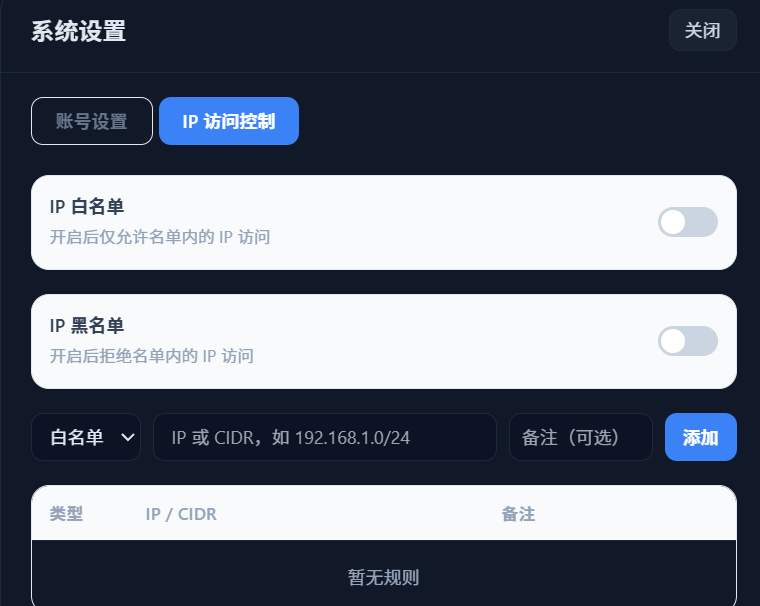
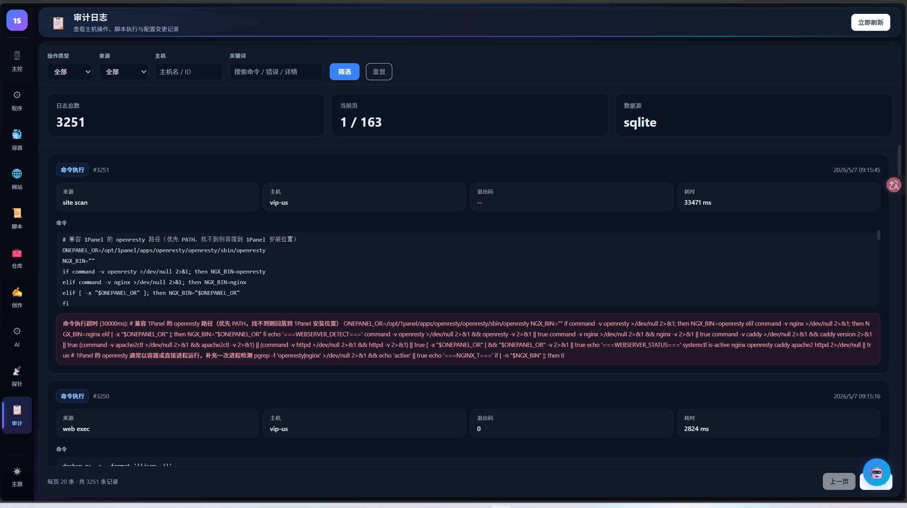

# 板块九：安全体系与审计日志

---

## 1. 安全体系概览

1Shell 在赋予 AI 强大权限的同时，设计了多层安全防护机制：

| 安全机制 | 说明 |
|---------|------|
| **安全模式** | AI 的每步写操作需人工审批 |
| **登录认证** | 用户名密码 + Session 管理 |
| **凭据加密** | AES-256-GCM + scrypt 随机盐 |
| **CSRF 防护** | HttpOnly Session Cookie + JS 可读 CSRF Cookie 双 Token |
| **暴力破解防护** | 同一 IP 连续失败 5 次锁定 60 秒 |
| **时序安全** | 密码比对使用 `crypto.timingSafeEqual` |
| **AI 频率限制** | Guardian 滑动窗口 `max_actions_per_hour` |
| **安全红线** | 硬编码禁止 `rm -rf /`、`shutdown` 等破坏性命令 |
| **IP 访问控制** | 白名单 / 黑名单 |
| **API 安全** | Helmet 安全头、CSP、限流 |
| **Bridge 鉴权** | 独立 Token，与 Web Session 隔离 |

---

## 2. IP 访问控制

进入方式：设置 → **「IP 访问控制」** 标签页



### 2.1 白名单模式

开启后，**仅允许**名单中的 IP 访问 1Shell。所有不在白名单中的 IP 请求都会被拒绝。

### 2.2 黑名单模式

开启后，**拒绝**名单中的 IP 访问。其他 IP 正常访问。

两种模式可同时开启。

### 2.3 添加规则

1. 选择类型：白名单 / 黑名单
2. 输入 IP 地址或 CIDR 格式网段（如 `192.168.1.0/24`）
3. 可选填写备注说明
4. 点击「添加」

规则列表按类型、IP/CIDR、备注三列展示，可随时删除。

---

## 3. 安全模式

安全模式是 AI 操作的人工审批机制。

### 3.1 开启方式

- 1Shell AI 面板顶部 → 点击 **「安全」** 复选框
- 或在设置中开启

### 3.2 工作流程

开启后，AI 的每一步**写操作**（执行命令、修改文件、创建资源）都会：

1. 在审批条中显示即将执行的操作内容
2. 用户点击 **「批准」** → 执行该操作
3. 用户点击 **「拒绝」** → 跳过该操作，AI 继续后续步骤

### 3.3 适用场景

- 生产环境操作，需要确认每步命令
- 初次使用 AI 功能，建立信任前的观察期
- 执行高风险操作（如修改配置、重启服务）

---

## 4. AI 安全红线

AI 硬编码禁止以下操作，即使用户或 AI 自主决策也无法绕过：

- `rm -rf /` — 删除根目录
- `shutdown` / `reboot` — 关机重启（需人工确认）
- 修改 SSH 配置 — 防止锁死远程访问
- 其他高危破坏性命令

Guardian AI 有 `max_actions_per_hour` 滑动窗口，防止 AI 在修复循环中失控。

---

## 5. 凭据加密

所有 SSH 密码和私钥使用 **AES-256-GCM + scrypt 随机盐** 加密存储：

- 每个凭据使用独立的随机盐
- 加密密钥派生自 `.env` 中的 `APP_SECRET`
- 即使数据库文件泄露，也无法还原明文凭据
- `APP_SECRET` 建议设置为 64 位以上的随机字符串

---

## 6. 反向代理配置

通过 Nginx 等反向代理访问时，需在 `.env` 中配置受信任代理 IP：

```env
TRUSTED_PROXY_IPS=127.0.0.1
```

不配置此项时，暴力破解防护获取到的客户端 IP 可能是代理 IP（如 127.0.0.1），导致所有用户共用一个 IP 限制。

---

## 7. 审计日志

审计日志记录所有操作，提供完整的追溯能力。

进入方式：左侧导航栏 → **「审计」**



### 7.1 顶部统计

| 指标 | 说明 |
|------|------|
| **总日志数** | 所有审计记录总数 |
| **总页数** | 分页信息 |
| **数据库** | 存储引擎（SQLite） |

### 7.2 筛选条件

| 筛选项 | 说明 |
|--------|------|
| **操作类型** | 全部 / SSH 执行 / 文件操作 / 登录 等 |
| **来源** | 全部 / 用户操作 / AI 操作 / 系统 |
| **主机名/ID** | 按主机筛选 |
| **搜索** | 按指令内容、结果、IP 模糊搜索 |

### 7.3 日志详情

每条日志记录包含：

| 字段 | 说明 |
|------|------|
| **审计编号** | 唯一标识 |
| **类型** | 操作类型（如 site scan、web exec） |
| **主机** | 执行操作的目标主机 |
| **退出码** | 命令执行的退出码（0 = 成功） |
| **耗时** | 操作执行时间（ms） |
| **时间戳** | 操作发生时间 |
| **完整命令** | 执行的具体命令内容 |
| **输出结果** | 命令的标准输出和错误输出 |

### 7.4 分页浏览

底部分页栏支持翻页浏览历史记录。
