# 1Shell 使用指南

> 版本：v3.3.0 | 更新日期：2025-05

---

## 目录

- [一、登录与系统设置](#板块一登录与系统设置)
- [二、主机管理](#板块二主机管理)
- [三、SSH 终端](#板块三ssh-终端)
- [四、文件管理](#板块四文件管理)
- [五、AI 功能](#板块五ai-功能)
- [六、运维程序](#板块六运维程序program)
- [七、Skill、Playbook、脚本库与创作工作台](#板块七skillplaybook脚本库与创作工作台)
- [八、MCP 接入与仓库](#板块八mcp-接入与仓库)
- [九、安全体系与审计日志](#板块九安全体系与审计日志)

---

# 板块一：登录与系统设置

---

## 1. 登录

### 1.1 访问面板

启动 1Shell 后，在浏览器中打开：

```
http://服务器IP:3301
```

如果是本机运行，直接访问 `http://localhost:3301`。

### 1.2 登录界面

登录页面包含两个输入框：

- **用户名** — 默认 `admin`
- **密码** — 默认 `admin`

输入后点击「登录」进入主界面。

### 1.3 首次登录注意事项

- **请立即修改默认密码**，方法见下方「账号设置」
- 如果通过 HTTP（非 HTTPS）+ 非 localhost 地址访问，部分浏览器可能会拦截 Cookie，导致登录后无法进入主界面。解决方案：
  - 推荐：配置域名 + SSL 证书，通过 HTTPS 访问
  - 临时：在浏览器设置中允许该站点使用 Cookie

### 1.4 暴力破解防护

同一 IP 连续登录失败 **5 次**后，自动锁定 **60 秒**，期间该 IP 的任何登录请求都会被拒绝。锁定到期后自动解除。

### 1.5 退出登录

点击右上角的「退出」按钮即可退出登录，会话立即失效。

---

## 2. 系统设置

点击主界面左下角的 **「⚙ 设置」** 按钮，弹出系统设置窗口。

设置窗口包含两个标签页：

### 2.1 账号设置

可以修改登录的用户名和密码。

| 字段 | 说明 |
|------|------|
| **用户名** | 新的登录用户名 |
| **新访问口令** | 新密码，留空表示不修改 |
| **确认新访问口令** | 再次输入新密码，两次必须一致 |

点击「保存设置」即时生效，**无需重启服务**。修改后会同时更新 `.env` 文件中的 `APP_LOGIN_USERNAME` 和 `APP_LOGIN_PASSWORD`。

### 2.2 IP 访问控制

控制哪些 IP 可以访问 1Shell 面板。

**白名单模式：**
- 开启后，只有名单中的 IP 可以访问
- 其他所有 IP 的请求都会被拒绝

**黑名单模式：**
- 开启后，名单中的 IP 无法访问
- 其他 IP 正常访问

两种模式可以同时使用。

**添加规则：**
1. 选择类型（白名单 / 黑名单）
2. 输入 IP 地址或 CIDR 格式网段（如 `192.168.1.0/24`）
3. 可选填写备注
4. 点击「添加」

已添加的规则在下方列表中展示，可随时删除。

---

## 3. AI API 配置

在主界面中找到 **AI 配置**入口（通常在 AI 功能区域附近），弹出 AI API 配置窗口。

| 字段 | 说明 | 示例 |
|------|------|------|
| **API 基础地址** | OpenAI 兼容 API 的地址，不含 `/chat/completions` | `https://api.openai.com/v1` |
| **API Key** | 对应服务商的 API 密钥 | `sk-xxxx...` |
| **模型名称** | 要使用的模型，可手动输入或点击「获取模型」自动拉取 | `gpt-4o` |

**兼容的 API 服务商：**
- OpenAI（官方）
- DeepSeek
- OpenRouter
- 任何兼容 OpenAI Chat Completions 格式的服务

点击「获取模型」按钮，会自动调用 API 拉取该服务商支持的模型列表，填入下拉框供选择。

配置完成后点击「保存」，所有 AI 功能（AI Chat、Ghost Text、命令建议、选区分析、1Shell AI、运维程序 AI 引擎）立即生效。

---

## 4. 环境变量配置（.env 文件）

除了在 Web UI 中配置，也可以直接编辑项目根目录下的 `.env` 文件。首次运行时会自动从 `.env.example` 复制一份。

### 4.1 完整变量说明

| 变量 | 必填 | 说明 | 默认值 |
|------|------|------|--------|
| `APP_LOGIN_USERNAME` | 否 | 登录用户名 | `admin` |
| `APP_LOGIN_PASSWORD` | **建议** | 登录密码，生产环境必须修改 | `admin` |
| `APP_SECRET` | **是** | 会话加密密钥，用于 SSH 凭据的 AES-256-GCM 加密存储 | 无 |
| `APP_SESSION_TTL_HOURS` | 否 | 登录会话有效期（小时） | `12` |
| `PORT` | 否 | 服务监听端口 | `3301` |
| `OPENAI_API_BASE` | 否 | AI API 基础地址 | `https://api.openai.com/v1` |
| `OPENAI_API_KEY` | 否 | AI API 密钥 | 无 |
| `OPENAI_MODEL` | 否 | AI 使用的模型名称 | `gpt-4o` |
| `BRIDGE_TOKEN` | 否 | MCP / Bridge API 鉴权 Token，启用 MCP 时必填 | 无 |
| `BRIDGE_EXEC_TIMEOUT_MS` | 否 | Bridge 命令执行超时（毫秒） | `30000` |
| `AGENT_DEFAULT_PROVIDER` | 否 | 默认 AI Agent 类型 | `claude-code` |
| `LOG_LEVEL` | 否 | 日志级别：debug / info / warn / error | `info` |
| `PROBE_TIMEOUT_MS` | 否 | 探针超时（毫秒） | `12000` |
| `PROBE_INTERVAL_MS` | 否 | 探针轮询间隔（毫秒） | `15000` |
| `PROBE_REMOTE_CONCURRENCY` | 否 | 远程探针并发数 | `3` |
| `TRUSTED_PROXY_IPS` | 否 | 受信任反向代理 IP，用于正确获取客户端真实 IP | 无 |

### 4.2 修改方式

```bash
# 用任意文本编辑器编辑
nano .env      # Linux
notepad .env   # Windows
```

修改 `.env` 后需要**重启 1Shell 才能生效**（Web UI 中修改的账号密码除外，那个是即时生效的）。

### 4.3 安全提示

- `APP_SECRET` 请设置为 64 位以上的随机字符串，用于加密存储 SSH 凭据
- `APP_LOGIN_PASSWORD` 生产环境请务必修改，不要使用默认的 `admin`
- `BRIDGE_TOKEN` 如果启用了 MCP 功能，请设置为高强度随机字符串
- `.env` 文件包含敏感信息，不要提交到版本控制（已在 `.gitignore` 中排除）


# 板块二：主机管理

---

## 1. 主控台概览

登录后进入主控台，这是 1Shell 的首页。

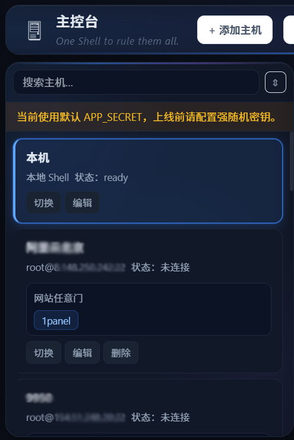

顶部显示「主控台」标题和 **「+ 添加主机」** 按钮，下方是搜索框和所有主机卡片列表。

### 1.1 本机

第一张卡片是「本机」，代表 1Shell 服务所在的机器本身，始终存在，不可删除。

- 显示「本地 Shell 状态：ready」
- 点击「切换」进入本机终端
- 点击「编辑」修改本机名称

### 1.2 远程主机卡片

每台远程主机以卡片展示，包含：

- **主机名称**（自定义）
- **连接信息**：`用户名@IP:端口`
- **连接状态**：已连接 / 未连接
- **网站任意门**：关联的业务链接（如 1panel 管理后台）
- **操作按钮**：切换（进入终端）、编辑、删除

### 1.3 搜索

搜索框支持按主机名称或 IP 地址模糊搜索，快速定位目标主机。

### 1.4 安全提示

如果使用默认的 `APP_SECRET`，顶部会显示黄色警告：「当前使用默认 APP_SECRET，上线前请配置强随机密钥。」请在 `.env` 中设置一个 64 位以上的随机字符串。

---

## 2. 添加与编辑主机

点击主控台右上角 **「+ 添加主机」** 或已有主机卡片的 **「编辑」** 按钮，打开主机配置表单。

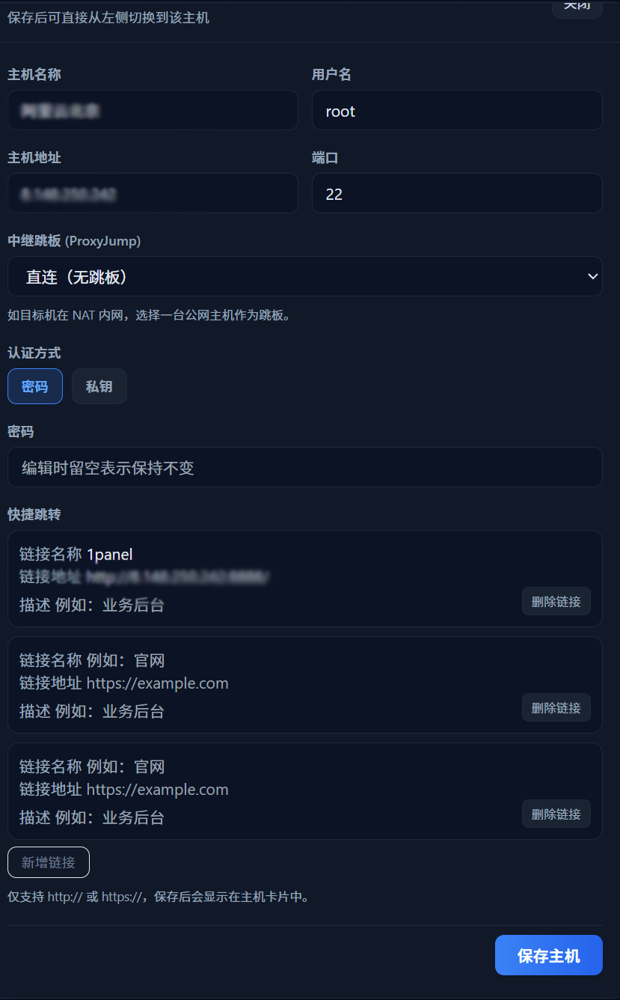

### 2.1 基础信息

| 字段 | 说明 | 示例 |
|------|------|------|
| **主机名称** | 自定义名称，方便识别 | 阿里云生产 |
| **用户名** | SSH 登录用户名 | root |
| **主机地址** | 服务器 IP 或域名 | 8.148.xxx.xxx |
| **端口** | SSH 端口 | 22 |

### 2.2 中继跳板（ProxyJump）

用于连接 NAT 内网中无法直接访问的机器。

- **直连（无跳板）**：默认选项，直接 SSH 连接目标主机
- **选择跳板机**：下拉选择一台已添加的公网主机作为跳板，1Shell 会先 SSH 到跳板机，再从跳板机 SSH 到目标内网机器

适用场景：目标机器在内网（如 `192.168.x.x`），只有一台公网机器可以访问它。

### 2.3 认证方式

两种认证方式可选：

**密码认证：**
- 选择「密码」标签
- 输入 SSH 密码
- 编辑时留空表示保持原密码不变

**私钥认证：**
- 选择「私钥」标签
- 粘贴 SSH 私钥内容（PEM 格式）
- 如果私钥有密码，还需填写密钥密码

所有凭据使用 AES-256-GCM 加密存储，不保存明文。

### 2.4 快捷跳转（网站任意门）

在同一个编辑表单的底部，可以为该主机添加多个业务链接。

每条链接包含：

| 字段 | 说明 | 示例 |
|------|------|------|
| **链接名称** | 链接的显示名称 | 1panel |
| **链接地址** | 完整 URL（仅支持 http:// 或 https://） | https://8.148.xxx.xxx:8888 |
| **描述** | 链接说明 | 业务后台 |

- 点击「新增链接」添加一条新链接
- 点击「删除链接」移除已有链接
- 保存后，链接会显示在主控台该主机卡片的「网站任意门」区域，点击即可在新窗口打开

### 2.5 保存

填写完成后点击右下角 **「保存主机」**，主机卡片立即出现在主控台。保存后可以直接从左侧切换到该主机的终端。

---

## 3. 探针中心

点击主控台顶部的探针入口，进入探针中心页面。

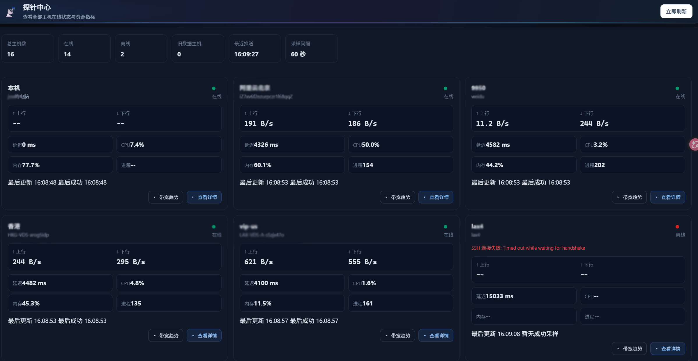

### 3.1 总览信息栏

页面顶部显示所有主机的汇总统计：

| 指标 | 说明 |
|------|------|
| **总主机数** | 已添加的主机总数 |
| **在线** | 探针正常采集的主机数 |
| **异常** | 探针采集失败或指标异常的主机数 |
| **离线** | 无法连接的主机数 |
| **最近更新** | 最近一次探针轮询的时间 |
| **轮询间隔** | 探针采集频率（默认 60 秒，可通过 `PROBE_INTERVAL_MS` 调整） |

### 3.2 单机探针卡片

每台主机一张卡片，实时展示以下指标：

| 指标 | 采集来源 | 说明 |
|------|---------|------|
| **网络流量** | `/proc/net/dev` | 上行/下行速率（B/s） |
| **延迟** | SSH 连接耗时 | 连接延迟（ms） |
| **CPU 使用率** | `/proc/stat` | 百分比 |
| **内存使用率** | `/proc/meminfo` | 百分比 |
| **磁盘使用率** | `df -P` | 百分比 |
| **最后更新** | — | 最近一次采集成功的时间 |

### 3.3 零侵入原理

1Shell 的探针**不需要在目标机器上安装任何 Agent**。

工作原理：通过已有的 SSH 连接，定期在目标机器上执行采集命令（如 `cat /proc/stat`），读取输出后在 1Shell 服务端解析。整个过程复用 SSH 链路，对目标机器零侵入。

### 3.4 异常与离线

- **异常**（橙色）：SSH 连接成功但采集命令执行失败，或返回数据异常
- **离线**（红色）：SSH 连接失败（如超时 `Timed out while waiting for handshake`）
- 主机离线时会实时告警

### 3.5 操作按钮

每张探针卡片底部有两个按钮：

- **查看数据**：查看该主机的详细指标数据
- **查看趋势**：查看该主机指标的历史趋势图

### 3.6 配置调整

探针相关的环境变量（在 `.env` 中配置）：

| 变量 | 说明 | 默认值 |
|------|------|--------|
| `PROBE_TIMEOUT_MS` | 单次探针采集超时 | 12000（12 秒） |
| `PROBE_INTERVAL_MS` | 轮询间隔 | 15000（15 秒） |
| `PROBE_REMOTE_CONCURRENCY` | 同时采集的主机数 | 3 |

---

## 4. 删除主机

在主控台的主机卡片上点击「删除」按钮，确认后删除该主机。

删除后：
- 主机配置和关联的 SSH 凭据被清除
- 探针停止采集
- 该主机的终端会话断开
- 网站任意门链接一并删除

本机（第一张卡片）不可删除。


# 板块三：SSH 终端

---

## 1. 界面布局

1Shell 的主界面分为三个区域：

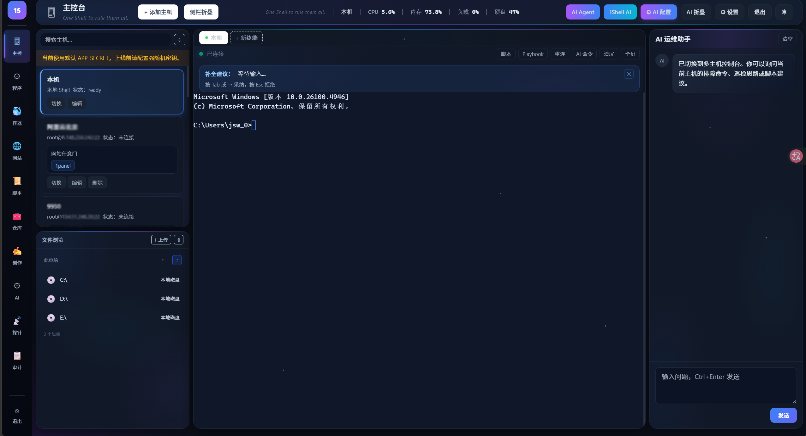

- **左侧边栏**：导航菜单（主控、程序、容器、网站、脚本、仓库、创作、AI、探针、审计）+ 主机列表 + 文件浏览器
- **中间区域**：终端主体
- **右侧面板**：AI 运维助手（可展开/收起）

---

## 2. 本地终端

登录后默认进入本机终端，即 1Shell 服务所在机器的 Shell。

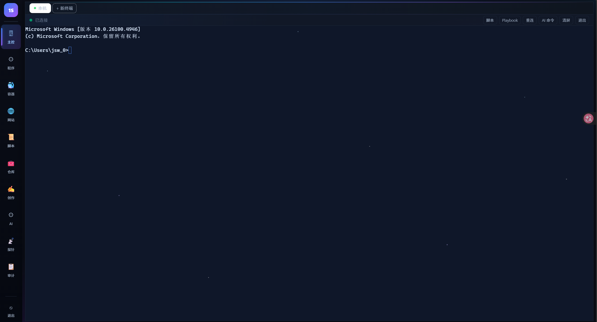

- Windows 系统显示 CMD / PowerShell
- Linux 系统显示 Bash / Zsh
- 状态栏显示「已连接」（绿色圆点）

---

## 3. 远程 SSH 终端

在左侧主机列表中点击任意远程主机的「切换」按钮，即可 SSH 连接到该主机。

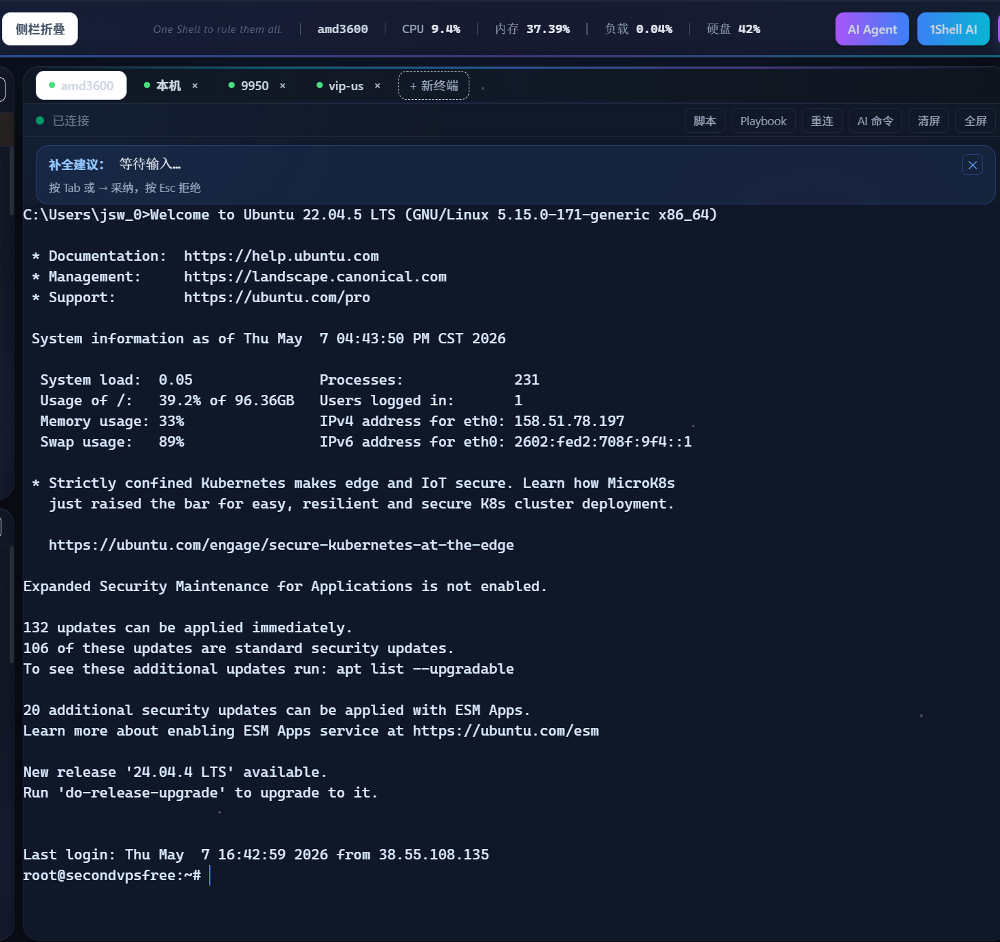

连接后：
- 终端标签页自动切换到该主机
- 顶部显示主机名称和实时指标（CPU、内存、负载、磁盘）
- 终端内容为远程主机的 Shell 会话

---

## 4. 多标签页

### 4.1 标签页管理

- 每台主机对应一个终端标签页
- 点击 **「+ 新终端」** 可打开新的本地终端标签页
- 点击标签页名称切换不同终端
- 多个终端之间互不干扰，可同时在不同服务器上操作

### 4.2 多 VPS 同时管理

通过标签页可以快速在多台 VPS 之间切换。左侧主机列表显示所有主机的连接状态，点击即切换。

---

## 5. 顶部信息栏

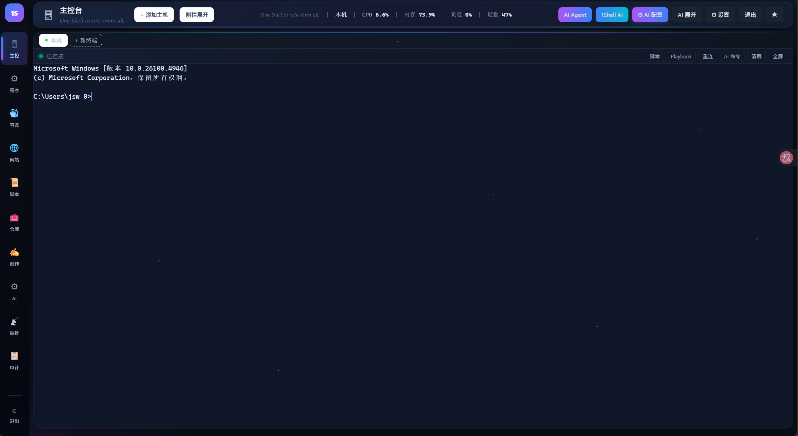

终端上方的信息栏从左到右依次显示：

| 区域 | 内容 |
|------|------|
| **主机标识** | 当前主机名称（如「本机」） |
| **实时指标** | CPU 使用率、内存使用率、负载、磁盘使用率 |
| **功能按钮** | AI Agent、1Shell AI、AI 配置、AI 展开、设置、退出 |

---

## 6. 终端工具栏

终端状态栏右侧提供以下工具按钮：

| 按钮 | 功能 |
|------|------|
| **脚本** | 打开脚本库，选择脚本注入终端执行 |
| **Playbook** | 运行一次性 AI Playbook |
| **重连** | 断线后重新连接当前会话 |
| **AI 命令** | 打开 AI 命令建议面板 |
| **清屏** | 清除终端屏幕内容 |
| **全屏** | 终端全屏显示，隐藏侧边栏和顶栏 |
| **退出** | 断开当前终端会话 |

---

## 7. 跳板机级联（ProxyJump）

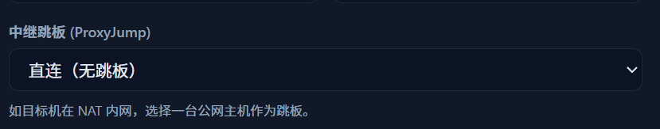

当目标机器在 NAT 内网，无法从公网直接 SSH 连接时，可通过跳板机级联：

1. 先在 1Shell 中添加一台公网可达的主机作为「跳板机」
2. 添加内网目标主机时，在「中继跳板」下拉框中选择跳板机
3. 1Shell 会自动通过跳板机建立 SSH 隧道，连接到内网目标

连接路径：`1Shell → 跳板机（公网） → 目标机器（内网）`

---

## 8. 左侧导航栏

左侧竖向导航栏提供以下页面入口：

| 图标 | 页面 | 说明 |
|------|------|------|
| 主控 | 主控台 | 主机列表、添加主机 |
| 程序 | 运维程序 | Program 管理 |
| 容器 | 容器管理 | Docker 容器管理 |
| 网站 | 网站任意门 | 业务网址快捷入口 |
| 脚本 | 脚本库 | 常用脚本管理 |
| 仓库 | 仓库 | 代码仓库 |
| 创作 | 创作工作台 | AI 创作 Program/Skill/Playbook |
| AI | AI 设置 | AI 功能配置 |
| 探针 | 探针中心 | 主机监控数据 |
| 审计 | 审计日志 | 操作记录查询 |
| 退出 | 退出登录 | 退出当前账号 |

---

## 9. 常用操作

### 9.1 复制粘贴

- **复制**：选中终端中的文本，自动复制到剪贴板（或 Ctrl+Shift+C）
- **粘贴**：Ctrl+Shift+V 或右键粘贴

### 9.2 断线重连

网络中断后终端会显示断开状态，点击工具栏的「重连」按钮恢复会话。

### 9.3 终端大小自适应

终端会自动适应浏览器窗口大小，调整窗口时终端列数和行数自动更新。


# 板块四：文件管理

---

## 1. 打开文件浏览器

文件浏览器位于左侧边栏的下半部分。点击「文件浏览」标题即可展开。

支持两种模式：
- **本地模式**：浏览 1Shell 服务所在机器的文件系统
- **远程模式（SFTP）**：浏览当前已连接的远程主机的文件系统

切换到不同主机的终端时，文件浏览器自动切换到对应主机的文件系统。

---

## 2. 目录浏览

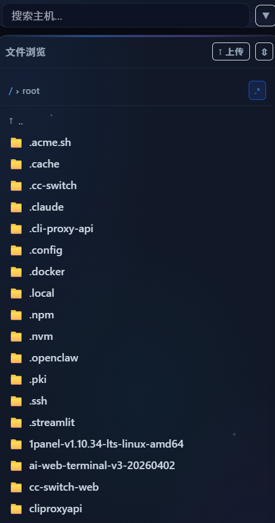

### 2.1 界面元素

- **路径栏**：显示当前目录路径（如 `/ > root`），点击路径中的任意层级可快速跳转
- **上传按钮**：上传文件到当前目录
- **返回上级**（`↑ ..`）：返回上一层目录
- **文件/文件夹列表**：黄色文件夹图标表示目录，文件图标表示文件

### 2.2 操作

- **点击文件夹**：进入该目录
- **点击文件**：打开文件预览
- 显示隐藏文件（以 `.` 开头的文件和文件夹）

---

## 3. 文件预览与编辑

点击任意文件后，打开文件预览界面。

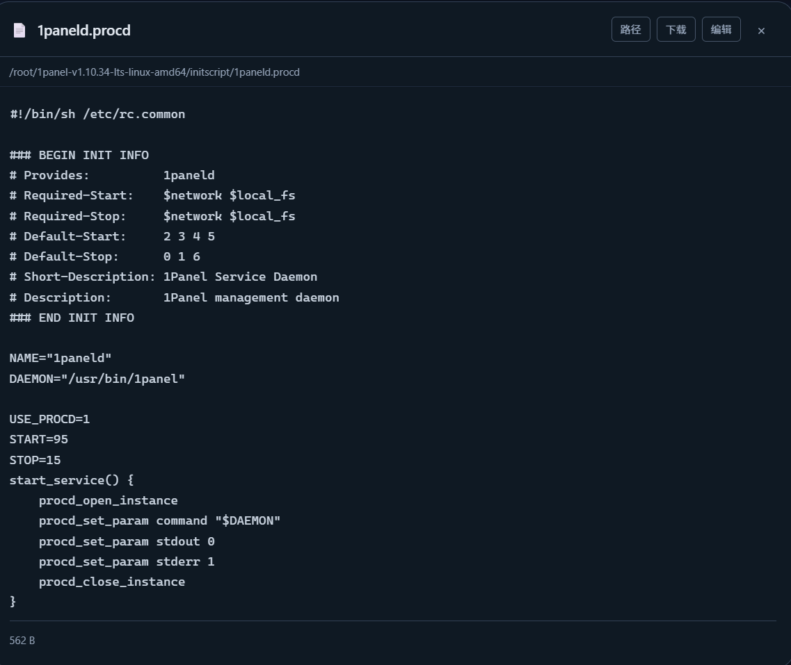

### 3.1 预览界面

- **文件名**：顶部显示文件名称（如 `1paneld.procd`）
- **完整路径**：文件名下方显示文件的完整路径
- **文件内容**：代码高亮显示文件内容
- **文件大小**：底部显示文件大小（如 `562 B`）

### 3.2 操作按钮

预览界面右上角提供以下操作：

| 按钮 | 功能 |
|------|------|
| **路径** | 复制文件的完整路径到剪贴板 |
| **下载** | 将文件下载到本地电脑 |
| **编辑** | 进入在线编辑模式，可直接修改文件内容并保存 |
| **×** | 关闭预览 |

---

## 4. 文件上传

点击文件浏览器顶部的 **「上传」** 按钮，选择本地文件上传到当前浏览的目录。

- 支持上传任意类型的文件
- 文件上传到当前目录路径
- 本地模式上传到 1Shell 所在机器
- 远程模式通过 SFTP 上传到远程主机

---

## 5. 在线编辑

在文件预览界面点击 **「编辑」** 按钮进入编辑模式：

1. 文件内容变为可编辑状态
2. 直接修改文件内容
3. 点击「保存」将修改写入文件

适用于快速修改配置文件、脚本等文本文件，无需通过终端使用 `vim` 或 `nano`。

---

## 6. 本地与远程对比

| 特性 | 本地模式 | 远程模式（SFTP） |
|------|---------|----------------|
| **文件系统** | 1Shell 服务器本机 | 远程 SSH 主机 |
| **传输协议** | 直接文件系统操作 | SFTP over SSH |
| **上传** | 支持 | 支持 |
| **下载** | 支持 | 支持 |
| **在线编辑** | 支持 | 支持 |
| **切换方式** | 选择本机终端标签 | 选择远程主机终端标签 |

文件浏览器与终端共享同一个 SSH 连接，不需要额外配置 SFTP 端口或权限。


# 板块五：AI 功能

---

## 1. AI 配置

使用任何 AI 功能前，需要先配置 AI API。点击顶栏的 **「AI 配置」** 按钮进入配置页面。

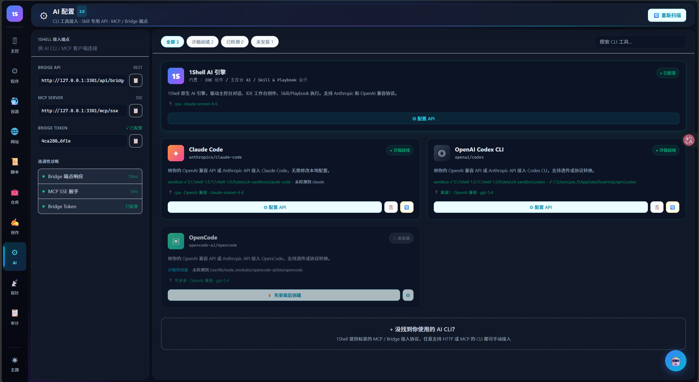

配置页面分为以下几个区域：

### 1.1 1Shell AI 引擎

页面中央展示 1Shell 内置的 AI 引擎说明。点击 **「配置 API」** 按钮设置：

| 字段 | 说明 | 示例 |
|------|------|------|
| **API 基础地址** | OpenAI 兼容 API 地址 | `https://api.openai.com/v1` |
| **API Key** | API 密钥 | `sk-xxxx...` |
| **模型名称** | AI 模型 | `gpt-4o` |

支持任何 OpenAI 兼容服务商（OpenAI、DeepSeek、OpenRouter 等）。

### 1.2 AI CLI 工具

页面下方展示可接入的 AI CLI 工具：

| 工具 | 说明 |
|------|------|
| **Claude Code** | Anthropic 官方 CLI，接入后可在 Agent 面板中使用 |
| **OpenAI Codex CLI** | OpenAI 官方 CLI |
| **OpenCode** | 开源 AI CLI 工具 |

每个工具卡片显示安装状态（已安装/未安装）和版本信息。

### 1.3 Bridge 配置（左侧栏）

| 字段 | 说明 |
|------|------|
| **Bridge API** | Bridge 端点地址（自动生成） |
| **MCP Server** | MCP SSE 端点地址（自动生成） |
| **Bridge Token** | 鉴权 Token（来自 `.env`） |

---

## 2. AI Chat（AI 运维助手）

AI Chat 是终端页面右侧的对话面板，用于在当前终端上下文中与 AI 交流。

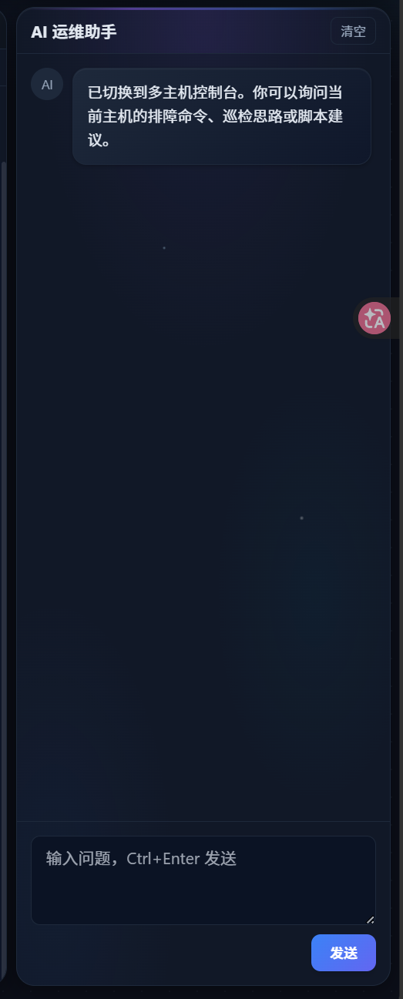

### 2.1 功能特点

- **终端上下文感知**：AI 能看到你当前终端的内容，基于实际输出提供建议
- **流式输出**：AI 回复实时流式显示
- **多主机适配**：切换主机后 AI 自动切换上下文

### 2.2 使用方式

1. 在终端右侧展开 AI 运维助手面板
2. 在输入框中输入问题
3. 按 **Ctrl+Enter** 或点击「发送」

### 2.3 使用场景

- 「这个错误是什么意思？」— AI 结合终端输出给出解释
- 「怎么查看 nginx 的错误日志？」— 给出适合当前系统的命令
- 「帮我写一个备份脚本」— 生成针对当前主机环境的脚本

---

## 3. 1Shell AI（全局 AI 助手）

1Shell AI 是平台的核心 AI 能力，相当于一个 7×24 小时的 AI 运维工程师。

### 3.1 全局面板模式

点击右下角的 AI 图标或顶栏的 **「1Shell AI」** 按钮，展开全局 AI 面板。

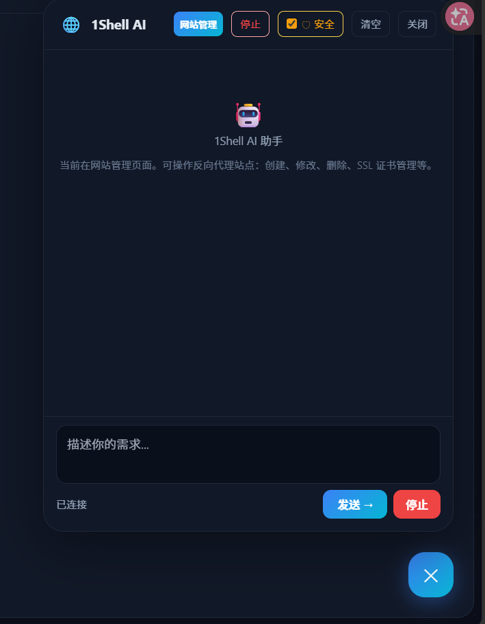

面板顶部功能栏：

| 按钮 | 功能 |
|------|------|
| **页面标签**（如「网站管理」） | 显示当前所在页面，AI 自动适配该页面的能力 |
| **停止** | 停止 AI 当前正在执行的操作 |
| **安全** | 安全模式开关，开启后 AI 的每步写操作需人工审批 |
| **清空** | 清除对话历史 |
| **关闭** | 收起面板 |

### 3.2 IDE 模式

在主控台或终端页面，1Shell AI 以 IDE 模式运行，拥有完整的服务器操作能力。

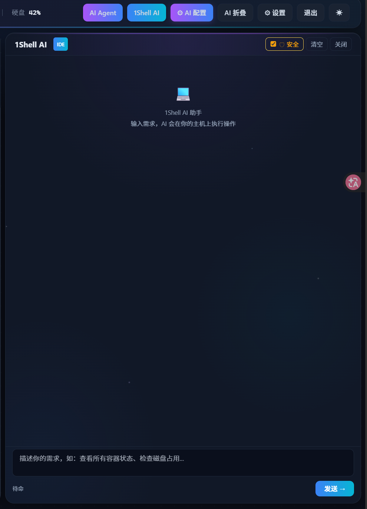

- 标题显示 **「1Shell AI」** + **「IDE」** 标签
- 输入框提示：「描述你的需求，如：查看所有容器状态、检查磁盘占用...」
- 状态栏显示「待命」/「执行中」

### 3.3 AI 拥有的能力

1Shell AI 内置 23 个工具，可以：

- **在任意主机上执行命令**：不需要手动切换终端
- **读写文件**：查看配置、修改文件
- **管理主机**：查看主机列表、主机状态
- **创建运维程序**：自动生成 Program / Skill / Playbook
- **操作网站**：创建/修改反向代理站点、管理 SSL 证书
- **查看监控数据**：读取探针采集的指标

### 3.4 页面感知

1Shell AI 会根据当前所在的页面自动调整能力描述：

| 页面 | AI 能力 |
|------|--------|
| 主控台 | 多主机管理、命令执行、文件操作 |
| 网站管理 | 反向代理站点创建/修改/删除、SSL 证书管理 |
| 容器管理 | Docker 容器操作 |
| 程序页 | Program 创建与调试 |

### 3.5 安全模式

开启安全模式后（点击「安全」按钮），AI 的每一步写操作都会弹出审批条：

- 显示 AI 即将执行的命令或操作
- 用户点击「批准」后才会执行
- 点击「拒绝」则跳过该操作
- 适用于生产环境，防止 AI 误操作

---

## 4. AI 选区分析

在终端中框选一段输出文本，AI 自动分析并给出解读。

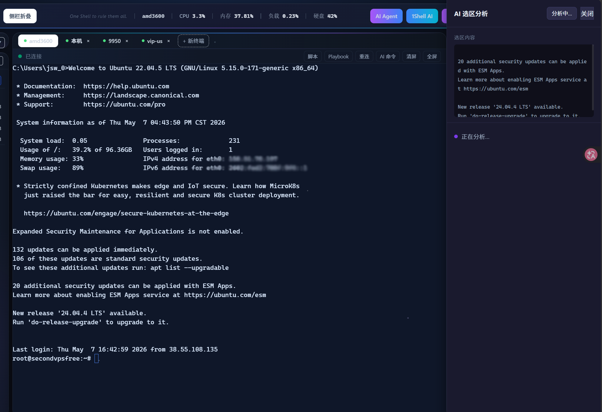

### 4.1 使用方式

1. 在终端中用鼠标框选一段文本（如错误日志、命令输出）
2. 右侧自动弹出「AI 选区分析」面板
3. AI 分析选中内容，给出解读和建议

### 4.2 分析内容

- **错误解读**：解释错误消息的含义
- **修复建议**：给出具体的修复命令
- **安全提示**：如发现安全更新未安装，提醒安装

---

## 5. Ghost Text（终端 AI 补全）

在终端输入命令时，AI 实时提供内联补全建议。

### 5.1 工作方式

1. 在终端开始输入命令
2. AI 根据输入内容和终端上下文，在光标后方显示灰色补全建议
3. 按 **Tab** 采纳建议
4. 继续输入则忽略建议

### 5.2 特点

- 实时响应，输入时自动触发
- 上下文感知，基于当前目录、历史命令提供建议
- 不干扰正常输入，建议以灰色文字显示

---

## 6. AI 命令建议

用自然语言描述需求，AI 生成可执行的 Shell 命令。

### 6.1 使用方式

1. 点击终端工具栏的 **「AI 命令」** 按钮
2. 在弹出的面板中用自然语言描述需求（如「查看占用 80 端口的进程」）
3. AI 生成对应的命令
4. 点击 **「注入终端」** 将命令写入终端
5. 按回车执行

### 6.2 优势

- 不需要记住复杂的命令语法
- AI 会根据当前操作系统生成正确的命令
- 生成的命令可以在注入前检查和修改

---

## 7. AI Agent 面板

AI Agent 面板可以在 1Shell 的 Web 界面中直接运行外部 AI CLI 工具。

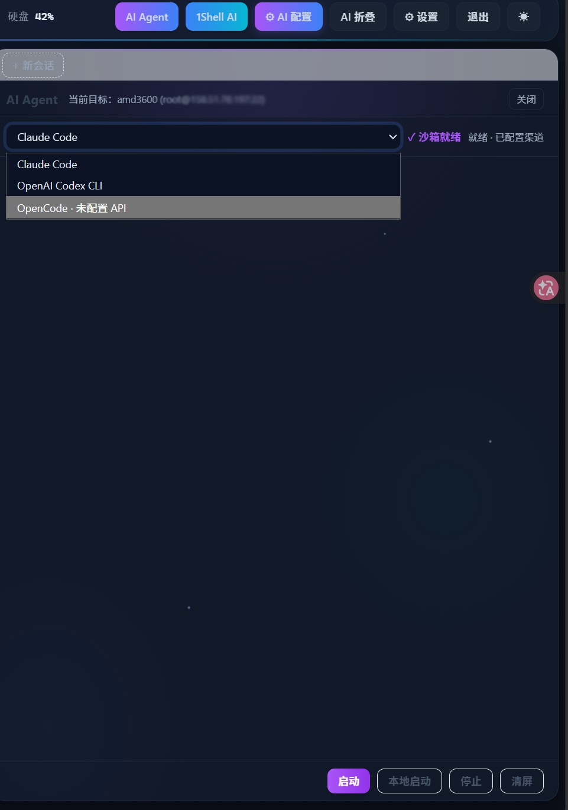

### 7.1 打开方式

点击顶栏的 **「AI Agent」** 按钮。

### 7.2 支持的 CLI 工具

| 工具 | 说明 |
|------|------|
| **Claude Code** | Anthropic 的 AI 编程助手 |
| **OpenAI Codex CLI** | OpenAI 的命令行工具 |
| **OpenCode** | 开源 AI CLI（需配置 API） |

通过下拉框切换不同的 CLI 工具。

### 7.3 操作按钮

| 按钮 | 功能 |
|------|------|
| **启动** | 在远程主机上启动 AI CLI |
| **本地启动** | 在 1Shell 本机上启动 AI CLI |
| **停止** | 终止运行中的 AI CLI |
| **清屏** | 清除输出 |

### 7.4 目标主机

面板顶部显示当前 Agent 的目标主机（如 `amd3600 (root@IP)`），AI CLI 将在该主机的环境中运行。

### 7.5 沙箱状态

状态栏显示沙箱就绪状态和配置来源，确保 AI CLI 在受控环境中运行。


# 板块六：运维程序（Program）

---

## 1. 概述

Program 是 1Shell 的核心能力——用声明式 YAML 定义长驻运维任务，按时间表自动在指定主机上执行，并配备三层 AI 引擎保障。

进入方式：左侧导航栏 → **「程序」**

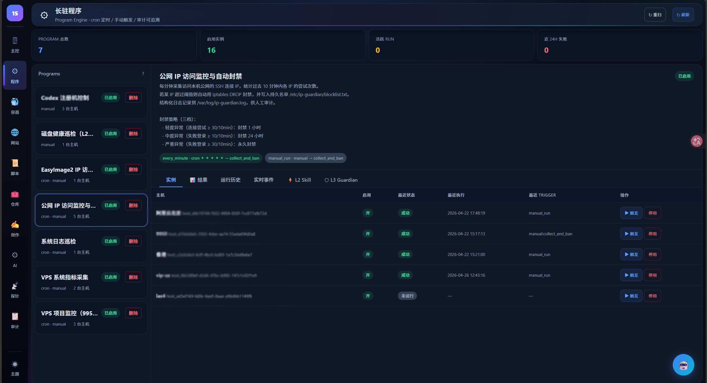

---

## 2. 页面布局

### 2.1 顶部统计栏

| 指标 | 说明 |
|------|------|
| **Program 总数** | 已创建的程序数量 |
| **总实例数** | 所有程序绑定的主机实例总数 |
| **活跃/运行中** | 当前启用并正在执行的实例数 |
| **近 24H 错误** | 最近 24 小时内执行失败的次数 |

### 2.2 左侧：程序列表

列出所有已创建的 Program，每个卡片显示：

- 程序名称
- 触发方式（cron / manual）
- 绑定的主机数
- 启用/停用状态（彩色标签）

点击程序卡片查看详情。

### 2.3 右侧：程序详情

选中程序后，右侧显示详细信息，分为多个标签页：

| 标签页 | 内容 |
|--------|------|
| **信息** | 程序名称、描述、YAML 配置 |
| **结果** | 最近一次执行的输出数据（render step 的展示） |
| **触发历史** | 所有执行记录，包含时间、状态、耗时 |
| **实时条件** | 当前 verify 条件的判定状态 |
| **L2 Skill** | 程序关联的 Skill 列表 |
| **L3 Guardian** | Guardian AI 的介入记录 |

---

## 3. 创建 Program

### 3.1 AI 创作（推荐）

1. 进入「创作工作台」（左侧导航 → 创作）
2. 用自然语言描述需求，例如：
   - 「每 5 分钟检查所有服务器的 CPU、内存、磁盘」
   - 「监控 nginx 进程，挂了自动重启」
   - 「每天凌晨 3 点清理 /tmp 目录」
3. AI 自动生成完整的 `program.yaml` 并写入文件

### 3.2 手动创建

在 `data/programs/<program-id>/` 目录下创建 `program.yaml` 文件。

---

## 4. 实例管理

每个 Program 绑定一台或多台主机，每台主机生成一个「实例」。

### 4.1 启用实例

程序详情 → 实例列表 → 点击目标主机旁的「启用」按钮。

启用后程序按 `triggers` 中定义的 cron 表达式自动执行。

### 4.2 手动触发

点击实例旁的「触发」按钮，立即执行一次（不受 cron 时间限制）。

### 4.3 自定义操作按钮

如果程序定义了 `ui.instance_actions`，实例卡片上会显示自定义按钮（如「立即检查」「强制重启」）。破坏性操作按钮为红色，点击后需确认。

---

## 5. 三层 AI 引擎

这是 1Shell 最重要的架构设计：

### 5.1 L1：确定性执行

- 运行预设的 Shell 命令（如 `cat /proc/stat`）
- 用 `verify` 规则判断成功/失败（退出码 + 正则匹配）
- **零 AI 消耗**，纯规则驱动

### 5.2 L2：AI 约束执行

- 当 L1 发现异常时，调用 Skill（AI 能力包）
- Skill 在限定范围内诊断和修复
- 通过 `when` 条件触发，避免无谓的 token 消耗
- **少量 AI 消耗**

### 5.3 L3：Guardian AI 全权介入

- L2 也无法修复时，Guardian AI 获得完整诊断权限
- 自主分析问题根因，执行修复
- 有 `max_actions_per_hour` 滑动窗口限制，防止 AI 失控循环
- **按需 AI 消耗**

### 5.4 设计理念

能用简单规则解决的不动用 AI，需要判断力的才让 AI 介入。既省成本，又保安全。

---

## 6. 查看结果

程序执行后，在「结果」标签页查看输出。支持四种展示格式：

| 格式 | 用途 |
|------|------|
| **keyvalue** | 键值对展示，适合单台主机的指标详情 |
| **table** | 表格展示，适合多台主机的指标对比 |
| **message** | 文本消息 |
| **list** | 列表展示 |


# 板块七：Skill、Playbook、脚本库与创作工作台

---

## 1. 创作工作台（IDE 工作台）

创作工作台是 1Shell 的 AI 创作中心，用于创建和管理 Program、Skill、Playbook。

进入方式：左侧导航栏 → **「创作」**


### 1.1 界面布局

- **左侧**：主机列表 + 文件树（可浏览主机上的文件）
- **中间**：AI 对话区域，用自然语言描述需求
- **右侧**：Skill 列表 + MCP 工具列表
- **底部**：工具开关（工具、学习能力、不联网）

### 1.2 使用方式

1. 在左侧选择目标主机（点亮主机名称）
2. 在中间输入框描述需求，例如：
   - 「帮我创建一个每 5 分钟检查 CPU 和内存的监控程序」
   - 「写一个磁盘清理的 Skill」
   - 「写一个批量部署 Docker 的 Playbook」
3. AI 自动创建对应的产物并写入文件

### 1.3 右侧面板

- **Skill 列表**：显示仓库中已有的 Skill（如磁盘健康巡检、Docker 运维救援）
- **MCP 工具列表**：显示已接入的 MCP 工具（如 phxdmcp、Office Word MCP Server）

---

## 2. Skill（AI 能力包）

Skill 是 AI 的能力模块，可被 Program 的 L2 层调用。

### 2.1 什么是 Skill

- 封装一个特定领域的 AI 能力（如磁盘清理、Docker 救援）
- 包含工作流（workflow）、约束规则（rules）、参考资料（references）
- 被 Program 调用时，AI 在 Skill 定义的范围内执行操作

### 2.2 查看已有 Skill

进入「仓库」页面（左侧导航 → 仓库），切换到 **Skill** 标签页。

每个 Skill 卡片显示名称、ID 和标签。

### 2.3 创建 Skill

在创作工作台中描述需求，AI 自动生成 Skill 文件结构：

```
data/skills/<skill-id>/
├── SKILL.md           # 路由与能力描述
├── rules/             # 约束规则
├── workflows/         # 工作流步骤
└── references/        # 参考资料
```

---

## 3. Playbook（一次性脚本）

Playbook 是一次性执行的 AI 脚本，适合临时操作。

### 3.1 与 Program 的区别

| | Program | Playbook |
|---|---------|----------|
| **执行方式** | 按 cron 定时执行，长期运行 | 一次性执行 |
| **适用场景** | 持续监控、定期巡检 | 批量部署、一次性清理、临时排障 |
| **AI 引擎** | 三层（L1/L2/L3） | 单次 AI 执行 |

### 3.2 使用方式

- 在终端工具栏点击 **「Playbook」** 按钮
- 或在创作工作台中创建

---

## 4. 脚本库

脚本库用于管理常用的 Shell 脚本。

进入方式：左侧导航栏 → **「脚本」**


### 4.1 界面布局

- **左侧**：脚本分类（全部、Docker、网络、常用、安全等）
- **中间**：当前分类下的脚本列表
- **右侧**：脚本内容预览和编辑

### 4.2 功能

| 操作 | 说明 |
|------|------|
| **新建脚本** | 右上角「新建脚本」按钮 |
| **分类管理** | 按类型组织脚本 |
| **搜索** | 按名称、标签、描述搜索 |
| **预览/编辑** | 选中脚本后在右侧查看和修改 |
| **注入终端** | 将脚本注入当前终端执行 |
| **导入/导出** | 批量导入导出脚本 |

### 4.3 与终端的配合

在终端工具栏点击 **「脚本」** 按钮，弹出脚本选择器，选择脚本后一键注入终端执行。


# 板块八：MCP 接入与仓库

---

## 1. 什么是 MCP

MCP（Model Context Protocol）是一个标准化协议，1Shell 通过 MCP 实现两个方向的 AI 协作：

- **对外暴露**：1Shell 自身作为 MCP Server，让 Claude Code 等外部 AI 工具直接调用多服务器管理能力
- **对内接入**：1Shell 可以接入外部 MCP 工具（天气、数据库、办公软件等），AI 运维过程中可调用

---

## 2. 仓库（Warehouse）

仓库是 Skill 和 MCP Server 的统一管理中心。

进入方式：左侧导航栏 → **「仓库」**

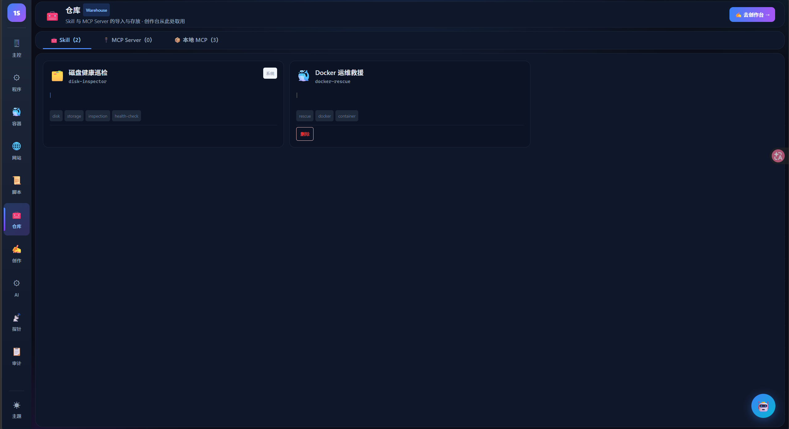

### 2.1 三个标签页

| 标签页 | 内容 |
|--------|------|
| **Skill** | 已有的 AI 能力包（如磁盘健康巡检、Docker 运维救援） |
| **MCP Server** | 远程 MCP Server |
| **本地 MCP** | 本地部署的 MCP Server（如 Office Word、PowerPoint） |

### 2.2 操作

- 点击 **「去创作台 →」** 跳转到创作工作台创建新的 Skill
- Skill 卡片显示名称、ID、标签
- 红色「删除」按钮可移除不需要的 Skill

---

## 3. AI 一键部署 MCP Server

1Shell 支持通过 AI 自动从 GitHub 部署 MCP Server。

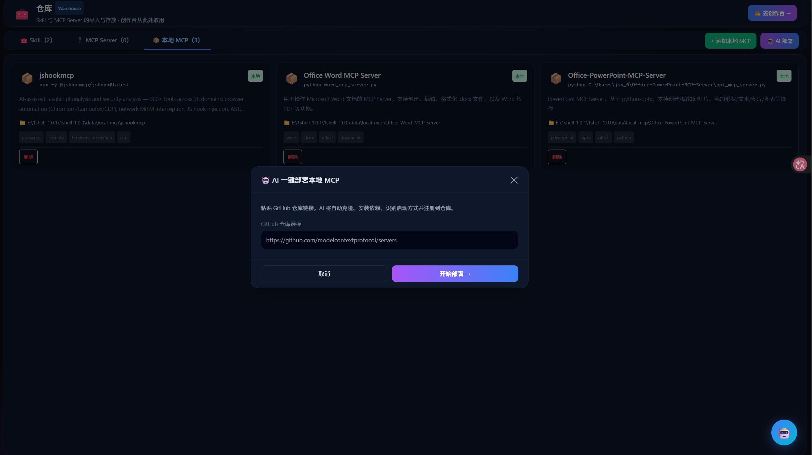

### 3.1 使用方式

1. 在仓库页面或 AI 配置页面，点击 **「AI 一键部署本地 MCP」**
2. 粘贴 GitHub 仓库链接（如 `https://github.com/modelcontextprotocol/servers`）
3. 点击 **「开始部署 →」**
4. AI 自动完成：克隆代码 → 安装依赖 → 初始化配置 → 注册为 MCP Server

部署完成后，MCP Server 自动出现在仓库的「本地 MCP」标签页中，创作工作台和 1Shell AI 可以直接调用。

---

## 4. 接入 Claude Code（对外 MCP）

### 4.1 一键接入

登录后点击顶栏 **「AI Agent」** → **「一键接入」**，自动完成 Claude Code 的 MCP 配置。

### 4.2 手动配置

编辑 `~/.claude/mcp_settings.json`：

```json
{
  "mcpServers": {
    "1shell": {
      "url": "http://你的服务器IP:3301/mcp/sse",
      "headers": { "X-Bridge-Token": "你的BRIDGE_TOKEN" }
    }
  }
}
```

### 4.3 可用 MCP 工具

| 工具 | 说明 |
|------|------|
| `execute_ssh_command` | 在指定主机执行命令，返回 stdout / stderr / exitCode |
| `list_hosts` | 列出所有已配置主机 |
| `list_mcp_tools` | 列出 1Shell 已接入的所有 MCP 工具 |
| `call_mcp_tool` | 调用 1Shell 已接入的 MCP 工具 |

### 4.4 Bridge API

除了 MCP 协议，1Shell 还提供 HTTP Bridge API：

```bash
curl -X POST http://localhost:3301/api/internal/bridge/exec \
  -H "X-Bridge-Token: your-token" \
  -H "Content-Type: application/json" \
  -d '{"hostId": "host-xxx", "command": "uptime"}'
```

适用于任何支持 HTTP 调用的工具或脚本。


# 板块九：安全体系与审计日志

---

## 1. 安全体系概览

1Shell 在赋予 AI 强大权限的同时，设计了多层安全防护机制：

| 安全机制 | 说明 |
|---------|------|
| **安全模式** | AI 的每步写操作需人工审批 |
| **登录认证** | 用户名密码 + Session 管理 |
| **凭据加密** | AES-256-GCM + scrypt 随机盐 |
| **CSRF 防护** | HttpOnly Session Cookie + JS 可读 CSRF Cookie 双 Token |
| **暴力破解防护** | 同一 IP 连续失败 5 次锁定 60 秒 |
| **时序安全** | 密码比对使用 `crypto.timingSafeEqual` |
| **AI 频率限制** | Guardian 滑动窗口 `max_actions_per_hour` |
| **安全红线** | 硬编码禁止 `rm -rf /`、`shutdown` 等破坏性命令 |
| **IP 访问控制** | 白名单 / 黑名单 |
| **API 安全** | Helmet 安全头、CSP、限流 |
| **Bridge 鉴权** | 独立 Token，与 Web Session 隔离 |

---

## 2. IP 访问控制

进入方式：设置 → **「IP 访问控制」** 标签页


### 2.1 白名单模式

开启后，**仅允许**名单中的 IP 访问 1Shell。所有不在白名单中的 IP 请求都会被拒绝。

### 2.2 黑名单模式

开启后，**拒绝**名单中的 IP 访问。其他 IP 正常访问。

两种模式可同时开启。

### 2.3 添加规则

1. 选择类型：白名单 / 黑名单
2. 输入 IP 地址或 CIDR 格式网段（如 `192.168.1.0/24`）
3. 可选填写备注说明
4. 点击「添加」

规则列表按类型、IP/CIDR、备注三列展示，可随时删除。

---

## 3. 安全模式

安全模式是 AI 操作的人工审批机制。

### 3.1 开启方式

- 1Shell AI 面板顶部 → 点击 **「安全」** 复选框
- 或在设置中开启

### 3.2 工作流程

开启后，AI 的每一步**写操作**（执行命令、修改文件、创建资源）都会：

1. 在审批条中显示即将执行的操作内容
2. 用户点击 **「批准」** → 执行该操作
3. 用户点击 **「拒绝」** → 跳过该操作，AI 继续后续步骤

### 3.3 适用场景

- 生产环境操作，需要确认每步命令
- 初次使用 AI 功能，建立信任前的观察期
- 执行高风险操作（如修改配置、重启服务）

---

## 4. AI 安全红线

AI 硬编码禁止以下操作，即使用户或 AI 自主决策也无法绕过：

- `rm -rf /` — 删除根目录
- `shutdown` / `reboot` — 关机重启（需人工确认）
- 修改 SSH 配置 — 防止锁死远程访问
- 其他高危破坏性命令

Guardian AI 有 `max_actions_per_hour` 滑动窗口，防止 AI 在修复循环中失控。

---

## 5. 凭据加密

所有 SSH 密码和私钥使用 **AES-256-GCM + scrypt 随机盐** 加密存储：

- 每个凭据使用独立的随机盐
- 加密密钥派生自 `.env` 中的 `APP_SECRET`
- 即使数据库文件泄露，也无法还原明文凭据
- `APP_SECRET` 建议设置为 64 位以上的随机字符串

---

## 6. 反向代理配置

通过 Nginx 等反向代理访问时，需在 `.env` 中配置受信任代理 IP：

```env
TRUSTED_PROXY_IPS=127.0.0.1
```

不配置此项时，暴力破解防护获取到的客户端 IP 可能是代理 IP（如 127.0.0.1），导致所有用户共用一个 IP 限制。

---

## 7. 审计日志

审计日志记录所有操作，提供完整的追溯能力。

进入方式：左侧导航栏 → **「审计」**


### 7.1 顶部统计

| 指标 | 说明 |
|------|------|
| **总日志数** | 所有审计记录总数 |
| **总页数** | 分页信息 |
| **数据库** | 存储引擎（SQLite） |

### 7.2 筛选条件

| 筛选项 | 说明 |
|--------|------|
| **操作类型** | 全部 / SSH 执行 / 文件操作 / 登录 等 |
| **来源** | 全部 / 用户操作 / AI 操作 / 系统 |
| **主机名/ID** | 按主机筛选 |
| **搜索** | 按指令内容、结果、IP 模糊搜索 |

### 7.3 日志详情

每条日志记录包含：

| 字段 | 说明 |
|------|------|
| **审计编号** | 唯一标识 |
| **类型** | 操作类型（如 site scan、web exec） |
| **主机** | 执行操作的目标主机 |
| **退出码** | 命令执行的退出码（0 = 成功） |
| **耗时** | 操作执行时间（ms） |
| **时间戳** | 操作发生时间 |
| **完整命令** | 执行的具体命令内容 |
| **输出结果** | 命令的标准输出和错误输出 |

### 7.4 分页浏览

底部分页栏支持翻页浏览历史记录。


